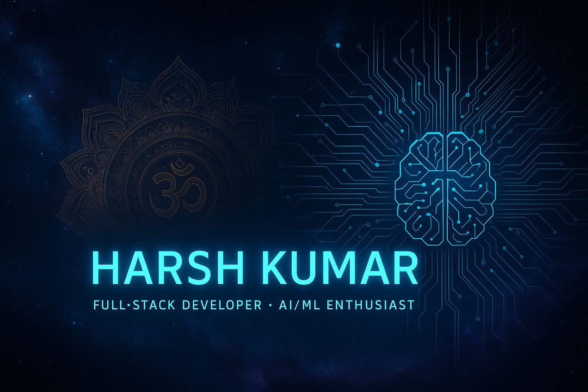

<!-- ==========================
     HARSH KUMAR — ANIMATED README (GitHub-Compatible)
     Theme: Futuristic AI x Space x Tech
   ========================== -->

  <!-- Banner -->
  

  <!-- Animated Name -->
  <h1 style="
      font-size:2.8rem;
      font-family:'Orbitron', sans-serif;
      color:#00FFFF;
      text-shadow:0 0 10px #00FFFF, 0 0 20px #00FFFF;
    ">
    Harsh Kumar
  </h1>

  <h3 style="color:#9be0ff; margin-top:-10px;">🚀 Full-Stack Developer | 🧠 AI & ML Enthusiast | ☁️ DevOps Learner</h3>

  
Crafting intelligent systems that fuse logic, design, and automation ✨

  <!-- Divider -->
  

  <!-- About Section -->
  <h2 style="color:#00FFFF;">🚀 About Me</h2>
  

    🎓 BE in Computer Science & Engineering — Ramaiah Institute of Technology (2022–2026) 
    💻 Building AI-integrated, DevOps-ready, and scalable applications. 
    🌱 Exploring <strong>LangChain</strong>, <strong>Next.js</strong>, and Generative AI systems. 
    🧠 Passionate about DSA, automation, and futuristic problem-solving.
  

  <!-- Neon Divider -->
  

  <!-- Tech Stack -->
  <h2 style="color:#00FFFF;">🧠 Tech Stack</h2>
  

  <!-- Neon Divider -->
  

  <!-- Projects Section -->
  <h2 style="color:#00FFFF;">🏗️ Featured Projects</h2>

  <!-- Cards Grid -->
  <table>
    <tr>
      <td width="33%" align="center" style="padding:15px;">
        

          <h3 style="color:#00FFFF;">🔬 Pepper Plant Disease Prediction</h3>
          
AI model using CNN & OpenCV to detect leaf diseases.

          <a href="https://github.com/deepspace1/pepper_plant_disease_prediction_using_ML" style="color:#00FFFF; text-decoration:none;">🔗 View Project</a>
        

      </td>
      <td width="33%" align="center" style="padding:15px;">
        

          <h3 style="color:#00FFFF;">🧾 Attendo</h3>
          
Barcode-based attendance system with CI/CD deployment.

          <a href="https://github.com/deepspace1/attendo" style="color:#00FFFF; text-decoration:none;">🔗 View Project</a>
        

      </td>
      <td width="33%" align="center" style="padding:15px;">
        

          <h3 style="color:#00FFFF;">🗄️ Chat With SQL Database</h3>
          
AI-powered interface to chat with SQL data using LangChain.

          <a href="https://github.com/deepspace1/chat_with_your_sql_database" style="color:#00FFFF; text-decoration:none;">🔗 View Project</a>
        

      </td>
    </tr>
  </table>

  
> A curated collection of my creative web projects — blending design, logic, and interactivity.

---

### 🎨 **Color Combination Generator**
A simple yet powerful utility for designers to generate aesthetic and balanced color palettes.

💻 **Tech Stack:**  

🔗 **[View Online](https://hkumar-me.github.io/Color-Combination-Generator/)**

---

### 🌅 **Sundown Studio Clone**
A responsive, pixel-perfect clone of the Sundown Studio landing page showcasing front-end precision and animations.

💻 **Tech Stack:**  

🔗 **[View Online](https://hkumar-me.github.io/sundown-studio-clone/)**

---

### 💼 **Portfolio Website**
My personal portfolio — a creative digital identity built with pure HTML, CSS, and JS to reflect simplicity and clarity.

💻 **Tech Stack:**  

🌐 **[Visit Portfolio](https://hkumar-me.github.io/HarshPortfolio/#home)**

---

### 🎮 **Number Game**
A fun and interactive browser-based number guessing game made to enhance logic and front-end interactivity.

💻 **Tech Stack:**  

🕹️ **[Play Now](https://hkumar-me.github.io/NumberGame/)**

---

## 🪐 Legacy GitHub Profile

These early projects were originally built under my previous GitHub account —  
a reflection of my early journey into design and development.

🔗 **[hkumar-me (Old Profile)](https://github.com/hkumar-me)**

🛰️ *Preserving the roots while evolving with AI, Tech, and Space-inspired creativity.*

---

  <!-- Neon Divider -->
  

  <!-- Stats -->
  <h2 style="color:#00FFFF;">📊 GitHub Stats</h2>
  

    
    
  

  

  <!-- Contact -->
  

  <h2 style="color:#00FFFF;">📫 Connect With Me</h2>
  

    
    
    
  

  

    “Code with logic, create with purpose, and evolve with curiosity.” ✨
  

